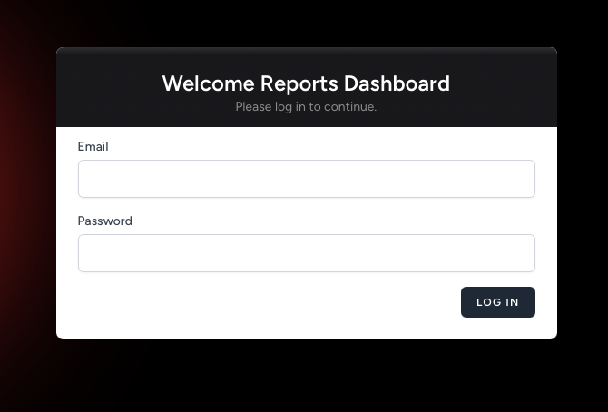
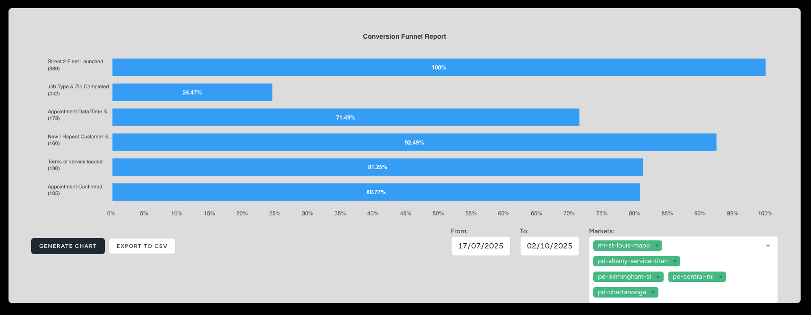
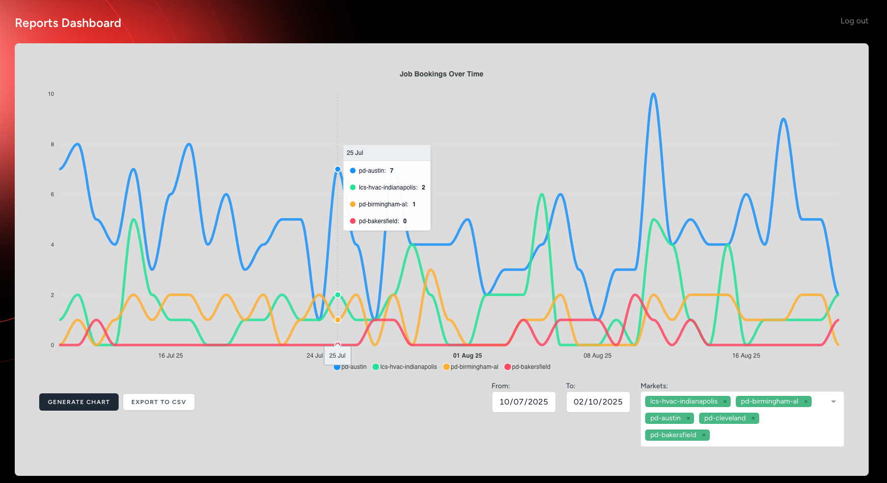
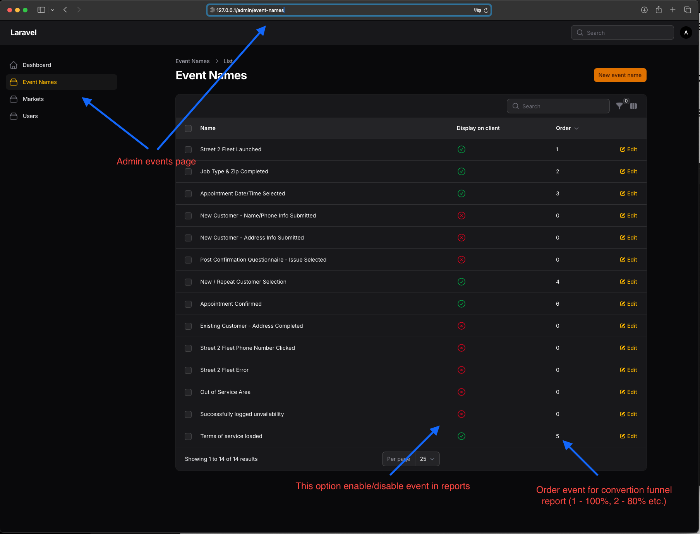
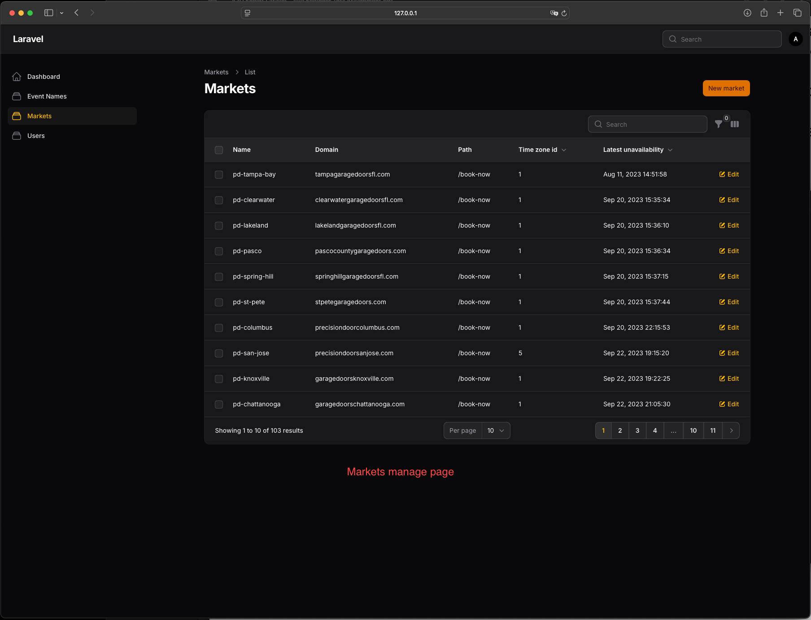
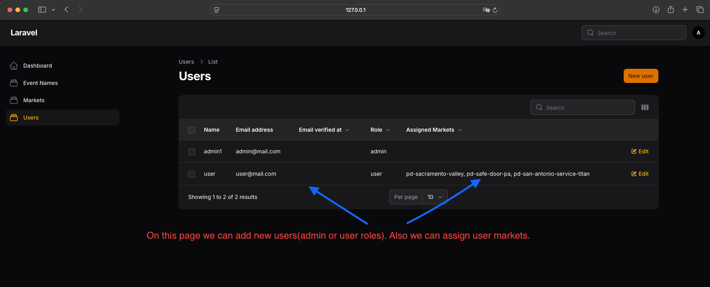

# Project Manual

## Getting Started

### Clone the Repository

```bash
git clone https://github.com/postgresman/reports
cd reports
```

### Install Dependencies

Make sure you have [Docker](https://docs.docker.com/get-docker/) installed.

```bash
composer install
```

### Start the Development Environment

Use Laravel Sail to run the required services (MySQL, Redis, Nginx, phpMyAdmin):

```bash
./vendor/bin/sail up
```

### Run Migrations with Seeders

To run migrations along with seeders, use the following command:

```bash
./vendor/bin/sail artisan migrate --seed
```

### Backup Database Data

To back up your database data, use the provided dump file located at `./database/reports_dump.sql.zip`. You can import it into your local MySQL instance with the following commands:

```bash
unzip ./database/reports_dump.sql.zip
./vendor/bin/sail mysql -u root -p < ./database/reports_dump.sql
```

Replace `root` and the password as needed for your setup.

### Access Services

- **Application:** http://localhost
- **FilamentAdminPanel** http://localhost/admin (Login: admin@mail.com, Password: password)
- **phpMyAdmin:** http://localhost:8081

## Additional Notes

- Update `.env` as needed for your environment.
- For more Sail commands, see [Laravel Sail documentation](https://laravel.com/docs/sail).

## Screenshots

Below are some example screenshots from the `./screenshots` folder:

| Screenshot | Description |
|------------|-------------|
|  | Login Page |
|  | Convertion Funnel Chart |
|  | Job Bookings Chart |
|  | Admin Events Page | 
|  | Admin Markets Page |
|  | Admin Users Page |